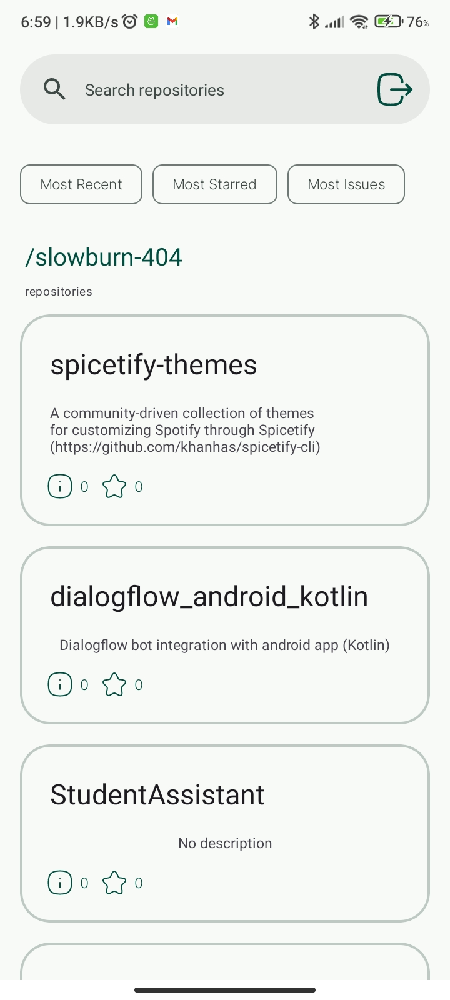
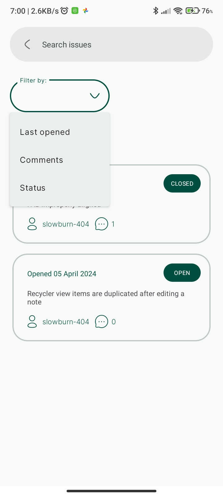
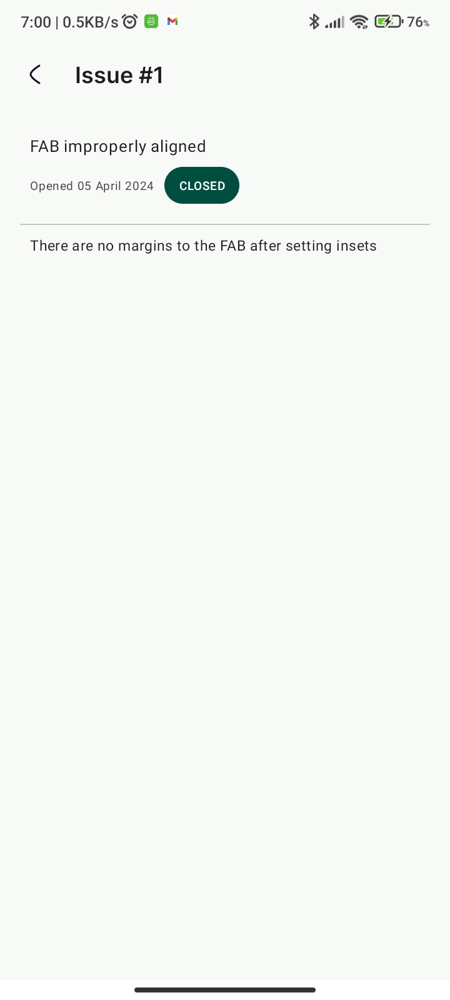

# GiTrack

GiTrack is a mobile application designed for tracking issues on GitHub. It provides a convenient interface for users to view, manage, and track issues across various GitHub repositories.

## [Figma designs, prototype and wireframe](https://www.figma.com/file/FXLDoaY1uL9sS5W0j1FZtJ/github_issue_tracker?type=design&node-id=0%3A1&mode=design&t=IXb2ZjKRUArJBQSn-1)


## Features

- **Login**: Authenticate your GitHub account via OAuth webflow.
- **Issue Tracking**: View and manage issues from multiple GitHub repositories.
- **Issue Details**: Get detailed information about each issue, including title, description, status, and date opened.
- **Repository Navigation**: Easily navigate between repositories and view their issues.
- **Search Functionality**: Search for specific issues within repositories.
- **Dark Mode Support**: Seamlessly switch between light and dark themes for comfortable viewing based on device theme.

## Screenshots

<p align="center">






</p>

## Installation

GiTrack is currently available for Android devices and can be installed from the Google Play Store. Simply search for "GiTrack" and follow the installation instructions.

- Clone the repository to your local machine.
```Bash
git clone https://github.com/slowburn-404/GiTrack.git
```
- Open the project in Android Studio, build and run on a virtual or real device.
## Usage

1. **Login**: Sign in with your GitHub account to access your repositories and issues.
2. **Browse Repositories**: Explore your repositories and select one to view its issues.
3. **View Issues**: Navigate through the list of issues and click on an issue to view its details.
4. **Search**: Use the search functionality to find specific issues or repositories by title, description, or label.
5. **Filter**: Filter repositories by most recent, most used and most starred. 

## Architecture


