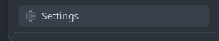

# GiTrack

GiTrack is a mobile application designed for tracking issues on GitHub. It provides a convenient interface for users to view, manage, and track issues across various GitHub repositories.

## [Figma wireframe and prototype](https://www.figma.com/file/FXLDoaY1uL9sS5W0j1FZtJ/github_issue_tracker?type=design&node-id=0%3A1&mode=design&t=IXb2ZjKRUArJBQSn-1)

## [Get it on Google Play](https://play.google.com/apps/internaltest/4700997486750488391)


## Features

- **Login**: Authenticate your GitHub account via OAuth webflow.
- **Issue Tracking**: View and manage issues from multiple GitHub repositories.
- **Issue Details**: Get detailed information about each issue, including title, description, status, and date opened.
- **Repository Navigation**: Easily navigate between repositories and view their issues.
- **Search Functionality**: Search for public repositories on GitHub or specific issues within repositories.
- **Dark Mode Support**: Seamlessly switch between light and dark themes for comfortable viewing based on device theme.

## Screenshots


## Installation
#### Obtain Client ID and Client Secrets
1. Navigate to the upper right corner of the GitHub Page and click on your avatar.

2. From the drop-down menu navigate to settings.

3. Scroll to developer settings.

4. Click on OAuth Apps.

5. Click on the New OAuth App.

6. Fill out the form.


7. Under Application Name, enter the name of your application; `GiTrack`. Under the homepage URL enter the Homepage URL of the app `https://gitrack.borisochieng.dev`. Under Authorization Callback URL enter the URL that GitHub will use to redirect back to your app; `https://gitrack.borisochieng.dev`. This can be the same as the Homepage URL.

8. Finally click on register application.

9. Copy the Client ID and Client Secret and store them for use in your app safely.

10. Add the Client Id and Client Secret to the `/local.properties` file.
```
client_id=YOUR_CLIENT_ID
client_secret=YOUR_CLIENT_SECRET
```
11. Clone the repository to your local machine.
```Bash
git clone https://github.com/slowburn-404/GiTrack.git
```
12. Open the project in Android Studio, build and run on a virtual or real device.

## Usage

- **Login**: Sign in with your GitHub account to access your repositories and issues.
- **Browse Repositories**: Explore your repositories and select one to view its issues.
- **View Issues**: Navigate through the list of issues and click on an issue to view its details.
- **Search**: Use the search functionality to find specific issues or repositories by title, description, or label.
- **Filter**: Filter repositories by most recent, most used, and most starred. 

## Application architecture overview

### OAuth Webflow
- The application utilizes OAuth web flow authentication instead of device flow to mitigate potential security risks. 
- The app launches a Web intent to the URL `https://github.com/login/oauth/authorize`. 
- After the user authorizes the application to access their account, they are redirected back to the App with a code using a Deep Link. 
- The app then makes a `POST` request to the URL `https://github.com/login/oauth/access_token` with the code to exchange it for an access token. The access token is then used to query the GitHub GraphQL API.
<p align="center">


### Tools, frameworks and libraries
                                                          
- **[Retrofit and OKHttp3](https://github.com/square/retrofit)**: This is used for making asynchronous network calls to facilitate authentication using the webflow.
- **[Apollo](https://github.com/apollographql/apollo-kotlin)**: GraphQL client used for making asynchronous network calls to the GitHub GraphQL API.
- **[Splashscreen](https://developer.android.com/develop/ui/views/launch/splash-screen)**: For branding purposes.
- **Kotlin**: programming language for writing logic.
- **XML**: mark up language for drawing UI elements.
- **[Material Design Components](https://github.com/material-components/material-components-android)**: Customizable Material Design UI components
- Android Architecture Components:
    - Viewmodel; lifecycle aware component.
    - Livedata; lifecycle aware component.
    - Navigation component to handle  navigation between fragments and  [safe arguments](https://developer.android.com/guide/navigation/use-graph/safe-args#kts) Gradle plugin for passing data between fragments.
    - [ViewBinding](https://developer.android.com/topic/libraries/view-binding) used for binding data to UI elements.


